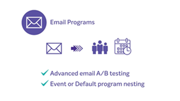

# [!DNL Marketo Engage] självstudier

Bläddra i vårt självstudiebibliotek och få ut det mesta av [!DNL Marketo Engage]. De här självstudiekurserna kan komplettera [[!DNL Marketo] produktdokumentationen](https://experienceleague.adobe.com/docs/marketo/using/home.html){target="_blank"} och hjälpa dig att få en bättre förståelse för funktioner för automatiserad marknadsföring.

<!-- 

 
-->

## Nyheter {#whats-new}

* [Bästa tillvägagångssätt för att implementera live-chatt](https://experienceleague.adobe.com/en/docs/marketo-learn/tutorials/dynamic-chat/live-chat-best-practices)
  _Lär dig mer om de bästa sätten att följa när du implementerar chattfunktionen i Dynamic Chat._

* [Interaktiva webbinarier - översikt](https://experienceleague.adobe.com/en/docs/marketo-learn/tutorials/events/interactive-webinars-overview)
  _Läs allt om Interactive Webinars, den inbyggda webbinariplattformen i Marketo Engage._

* [Migrerar till Adobe Identity Management](https://experienceleague.adobe.com/en/docs/marketo-learn/tutorials/fundamentals/migrating-to-adobe-identity-management)
  _Lär dig navigera i migreringen av Adobe Identity Management så att du kan börja hantera Adobe Marketo Engage tillsammans med andra Adobe-konton och -produkter åt dina användare på en central plats._

## De populäraste videoklippen {#most-popular-videos}

<table>
<tr>
<td>

<a href="https://experienceleague.adobe.com/en/docs/marketo-learn/tutorials/programs-and-campaigns/smart-campaigns-101"><strong>Smarta kampanjer 101</strong></a>

</td>
<td>

<a href="https://experienceleague.adobe.com/en/docs/marketo-learn/tutorials/dynamic-chat/conversational-forms"><strong>Forms för konversationer</strong></a>

</td>
<td>

<a href="https://experienceleague.adobe.com/en/docs/marketo-learn/tutorials/fundamentals/programs-and-campaigns"><strong>Förstå Marketo program och kampanjer</strong></a>

</td>
</tr>
</table>
