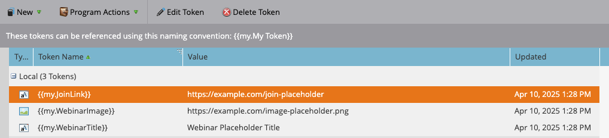

# Så här utlöser du en smart kampanj i Marketo Engage med REST API och tokens

I den här självstudiekursen får du lära dig hur du aktiverar en Smart Campaign i Marketo Engage med REST-API:t och anpassar e-postmeddelandet med Mina token. Det här användningsexemplet är idealiskt för kundutlösta meddelanden som webbinarier, introduktionssteg eller uppföljningar efter köp.

## Använd skiftläge {#use-case}

En person registrerar sig för ett webbinarium via en extern plattform (t.ex. en anpassad app, Pendo, EventBrite). Du vill automatiskt:

* Starta ett påminnelsemejl från Marketo Engage
* Anpassa den med:
   * Personens förnamn
   * Webbinariets titel
   * En unik kopplingslänk

Detta kan göras med REST API och Mina token.

## Steg 1: Skapa den smarta kampanjen {#step-one}

1. Gå till **Marknadsföringsaktiviteter** och skapa en ny [Smart Campaign](https://experienceleague.adobe.com/sv/docs/marketo/using/product-docs/core-marketo-concepts/smart-campaigns/understanding-smart-campaigns){target="_blank"} med namnet `Send Webinar Reminder` i mappen [Program](https://experienceleague.adobe.com/sv/docs/marketo/using/product-docs/core-marketo-concepts/programs/creating-programs/understanding-programs){target="_blank"}.

1. [Lägg till en utlösare](https://experienceleague.adobe.com/sv/docs/marketo/using/product-docs/core-marketo-concepts/smart-campaigns/creating-a-smart-campaign/define-smart-list-for-smart-campaign-trigger){target="_blank"} på fliken **Smart lista** så att kampanjen kan anropas via API:t:

   * Välj **Kampanjen är begärd** som utlösare
   * Ange **Source** till `Web Service API`


## Steg 2: Definiera e-postinnehållet {#step-two}

Skapa eller redigera en [e-postresurs](https://experienceleague.adobe.com/sv/docs/marketo-developer/marketo/rest/assets/emails){target="_blank"} som refererar till både person och [Mina token](https://experienceleague.adobe.com/sv/docs/marketo/using/product-docs/core-marketo-concepts/programs/tokens/managing-my-tokens){target="_blank"}.

>[!NOTE]
>
>Se till att du infogar variablerna direkt i e-postinnehållet, så som visas nedan.

```html
Hi {{lead.First Name:default=Customer}}

You're registered for **{{my.WebinarTitle}}**.

Join here: {{my.JoinLink}}
```

Om du använder en token för att dynamiskt mata in en bild-URL (t.ex. `{{my.WebinarImage}}`) måste du omsluta token i en HTML-bildtagg:

```html

```

>[!IMPORTANT]
>
>Marketo Enagage **återger inte bilden** om inte variabeln placeras inuti en giltig bildtagg.


## Steg 3: Lägg till variabler i programmet {#step-three}

Om du vill skicka värden dynamiskt via API måste tokenerna redan finnas i Marketo Engage. Du måste skapa dem på fliken **Mina token** i ditt program.

1. Gå till fliken **Mina token** i ditt överordnade program.

2. Dra en **texttoken** från den högra panelen för varje dynamiskt värde.

* `{{my.WebinarTitle}}` - Texttoken
* `{{my.JoinLink}}` - Texttoken
* `{{my.WebinarImage}}` - Texttoken (detta används som `src` i en `` -tagg)



## Steg 4: Ange regler för kampanjkvalificering och aktivera kampanj {#step-four}

1. Konfigurera [kvalificeringsreglerna](https://experienceleague.adobe.com/sv/docs/marketo/using/product-docs/core-marketo-concepts/smart-campaigns/using-smart-campaigns/edit-qualification-rules-in-a-smart-campaign){target="_blank"} för att kontrollera hur ofta en person kan köra via Smart Campaign.

1. När konfigurationen är klar klickar du på **Aktivera** för att aktivera den smarta kampanjen för att ta emot API-utlösta begäranden.


## Steg 5: Trigga kampanjen via REST API {#step-five}

### Hitta kampanj-ID {#find-the-campaign-id}

Om du vill aktivera en smart kampanj via API behöver du **kampanj-ID**:

1. Hitta och välj den smarta kampanj du vill utlösa.

1. Titta på webbadressen i webbläsaren. Det kommer att se ut ungefär så här: `https://app-XXX.marketo.com/#/classic/SC`**1234**`A1ZN38`.

1. De fyra siffrorna efter `SC` är ditt kampanj-ID, i ovanstående exempel är Smart Campaign-ID 1234

Använd följande slutpunkt:

```
POST /rest/v1/campaigns/{campaignId}/trigger.json
```

Exempel:

```
POST /rest/v1/campaigns/1234/trigger.json
```

### Exempelbegärandetext {#example-request-body}

```json
{
  "input": {
    "leads": [
      {
        "id": 1002200
      }
    ],
    "tokens": [
      {
        "name": "{{my.WebinarTitle}}",
        "value": "Scaling Customer Engagement in 2025"
      },
      {
        "name": "{{my.JoinLink}}",
        "value": "https://webinars.company.com/join/abc123"
      },
      {
        "name": "{{my.WebinarImage}}",
        "value": "https://experienceleague.adobe.com/sv/docs/marketo-learn/tutorials/events/media_1c6f338a518ada11550084c8ab3a6bbf554ff6eac.jpeg"
      }
    ]
  }
}
```

>[!IMPORTANT]
>
>Ersätt `1002200` i exemplet ovan med rätt person-ID från din Marketo Engage-instans.

## Behörighet {#authorization}

Alla Marketo REST API-begäranden kräver en OAuth 2.0-åtkomsttoken.

Använd följande slutpunkt för att hämta din åtkomsttoken:

```
GET /identity/oauth/token?grant_type=client_credentials&client_id=XXX&client_secret=YYY
```

När du har tagit emot din åtkomsttoken tar du med den som en _frågeparameter_ i alla API-begäranden:

```
Authorization: Bearer YOUR_ACCESS_TOKEN
```

## Bästa praxis {#best-practices}

* Lägg till reservvärden/standardvärden i token för testning och kvalitetskontroll
* Använd `{{lead.token}}` för personfält och `{{my.token}}` för dynamiska värden som omfattar kampanjer
* Marketo Engage stöder upp till 100 personer per begäran
* Personerna måste uppfylla kriterierna för smart lista, annars hoppas de inte över i tysthet

## Sammanfattning {#summary}

Med den här metoden kan ni personalisera kommunikation med smarta kampanjer som triggas från externa plattformar via API. Detta är användbart för scenarier som bekräftelser av registrering på webbinarium, e-postmeddelanden om introduktion och transaktionsmeddelanden - samtidigt som du matar in realtidsdata med Mina token.
